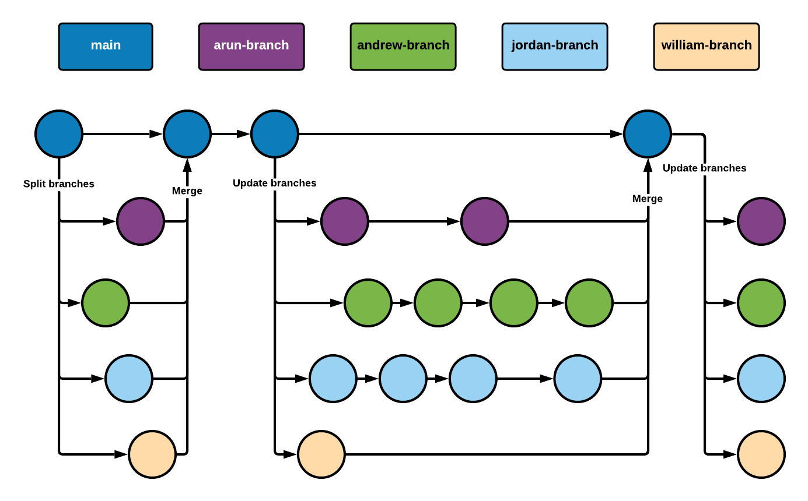

# Python Plane Project
In this project, we are tasked to create a flight management system that allows airport assistants to create and manage flight bookings.

## Gitflow
The image below is a visualisation of our Gitflow. The main branch is split into a separate branch for each contributor. Each contributor will push their changes to their own branch. After progress has been made, the individual branches will be merged back with the main branch. 



### Gitflow in Git commands
The following steps is the merge process for our project.
 1. Update each of the branches by using `git pull` on each of them. This fetches the most recent version from GitHub.
 2. Change to the main branch with `git checkout main`. This is the branch we will merge into.
 3. Each branch will be merged into the main branch. The following commands will be executed:
    ```
    git merge arun-branch
    git merge andrew-branch
    git merge jordan-branch
    git merge william-branch
    ```
 4. With the main branch up-to-date, push the changes to the main branch. Next, each contributor's branch will be updated with the main branch. The following commands will be executed for each branch, where "arun" will be replaced with the contributor's respective firstname:
    ```
    git branch -M arun-branch
    git checkout arun-branch
    git push -u origin arun-branch
    ```
Now, each branch is up-to-date with the main branch, locally and remotely. 

## Git commands
### Pulling code
Execute the following commands if you are pulling the remote repository for the first time.
```
git init
git remote add origin https://github.com/William-King977/eng84_python_plane_project
git pull
```

To pull code any other time, use `git pull`.

### Pushing code
To push changes to a GitHub repository, enter the following:
```
git add .
git commit -m "describe your changes"
git push -u origin branch_name
```

To push specific files, such as README.md, use `git add README.md` instead of `git add .`.

### Branches
#### Viewing branches
 * To view the branches in your local Git repository, type `git branch`. This will only show the branches you have switched to. The output should be similar to what is shown below:
   ```
     main
   * william-branch
   ```
   **Note:** the * denotes the current branch you are working on. 
 * To view the branches on the GitHub repository, type `git branch -r`. The output should be:
   ```
   origin/andrew-branch
   origin/arun-branch
   origin/jordan-branch
   origin/main
   origin/william-branch
   ```

#### Switch branches
To switch to another branch, use `git checkout` as shown below.
```
git checkout branch_name
```

#### Creating branches
To create a new branch, use `git branch` as shown below.
```
git branch -M new_branch_Name
```

### Conflicts
The following deals with a conflict in the README.md file of both the local Git and the remote GitHub repository. The repository is named `test_repo` for this purpose.

Before we assume that there is a conflict, pull the code first by using `git pull`. If there is a conflict, you may get the following message:
```
error: Your local changes to the following files would be overwritten by merge:
        README.md
Please commit your changes or stash them before you merge.
Aborting
```

At this point, add, commit and push your changes. After executing the push command, you may get the following message:
```
 ! [rejected]        main -> main (non-fast-forward)
error: failed to push some refs to 'https://github.com/William-King977/test_repo'
hint: Updates were rejected because the tip of your current branch is behind
hint: its remote counterpart. Integrate the remote changes (e.g.
hint: 'git pull ...') before pushing again.
hint: See the 'Note about fast-forwards' in 'git push --help' for details.
```

Now, use the `git pull` command to pull the changes from the remote repository (GitHub). This will merge the conflicts. 

Open the file(s) that have conflicts to resolve them. The conflicted sections will be surrounded with `<<<<<<< HEAD`, `>>>>>>>` and separated by `=======` as shown below.
```
<<<<<<< HEAD
* This is different to GitHub, from the local Git repo.
* Who won? Well, we'll find out in June! From Git repo.
=======
* The change on the main branch on GitHub
* Who's going to win WSM 2021? From GitHub test repo
>>>>>>> 327cf2f0e9025400c0a1db24d19ddbd6ae87792a
```

After you feel the conflicts have been resolved, add, commit and push your changes. The GitHub repository should now be updated with the new changes.

## Contributors
 * [Andrew Asare](https://github.com/Andrew-Asare)
 * [Arun Panesar](https://github.com/ArunPanesar42)
 * [Jordan Clarke](https://github.com/JClarke-96) (currently shown as "Your Name" for some reason)
 * [William King](https://github.com/William-King977)
